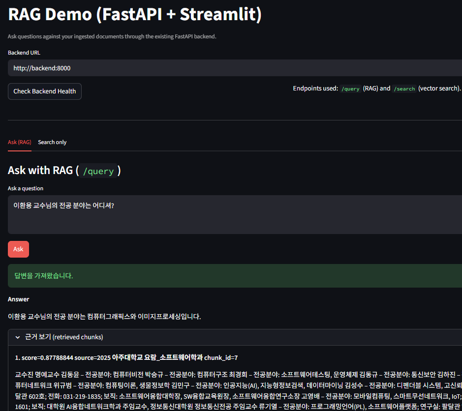

# foss-2025-2-final

## 이름
이주영

## 학번 
20216818

---

## 동기

LLM의 기술적 발전은 많은 곳에서 도움이 되고 있다.
하지만 LLM은 아직 학습하지 못한 최신 정보, 특정 분야, 조직 내부 데이터 등에 대해서는 정확한 답변을 주지 못한다.
또한 이것은 할루시네이션 문제 혹은 신뢰도가 낮고 설명력이 부족한 정보의 생성으로 이어진다.
 
이와 관련하여 본 프로젝트에서는 RAG를 사용하여 Qdrant를 포함한 다양한 오픈소스로 문서 기반 질의응답 시스템을 구현함으로써 사용자의 관심 분야에 대한 정확도 높은 답변을 제공하는 것을 목표로 한다.

검색 증강 생성(Retrieval-augmented generation, RAG)은 대형 언어 모델 (LLM)이 새로운 정보를 검색하고 통합할 수 있도록 하는 기술이다.
RAG를 사용하면 LLM은 지정된 문서 집합을 참조할 때까지 사용자 쿼리에 응답하지 않는다. 
이 문서들은 LLM의 기존 훈련 데이터의 정보를 보완한다.
이를 통해 LLM은 훈련 데이터에서 사용할 수 없는 도메인 특정 및 업데이트된 정보를 사용할 수 있다.
예를 들어, 이는 LLM 기반 챗봇이 내부 회사 데이터에 접근하거나 권위 있는 출처를 기반으로 응답을 생성하는 데 도움이 된다. 
(출처: [위키백과 - 검색증강생성성](https://ko.wikipedia.org/wiki/%EA%B2%80%EC%83%89%EC%A6%9D%EA%B0%95%EC%83%9D%EC%84%B1))

---

## 수행 내용

### 1. 실행환경 세팅
- `backend/main.py`, `backend/requirements.txt`, `backend/Dockerfile`, `backend/docker-compose.yml`
- Docker Compose 기반 FastAPI + Qdrant 환경 구성
- 서버 및 Swagger 정상 동작 확인

### 2. 문서 Ingestion & Chunking
- `backend/app/routers/ingest.py`, `backend/app/models/schemas.py`, `backend/app/services/ingestion.py`, `backend/app/utils/text_cleaning.py`, `backend/app/services/chunker.py`
- 문서 정제 기능 구현
- 문서를 일정 길이의 chunk로 분할
- `/ingest` API를 통해 chunk 결과 반환

### 3. Embedding
- `backend/app/services/embedding.py`, `backend/app/routers/test_embed.py`
- Sentence-Transformers 기반 embedding 적용
- `/test-embed` API로 embedding 벡터 테스트

### 4. Qdrant Vector DB upsert & search
- `backend/app/services/qdrant_client.py`, `backend/app/routers/search.py`
- Qdrant 컬렉션 자동 생성
- chunk + embedding → Qdrant 저장
- `/search?q=` API로 관련 chunk 검색
- end-to-end ingestion 파이프라인 완성

### 5. Retrieval 파이프라인 구성
- `backend/app/routers/query.py`, `backend/app/services/retriever.py`, `backend/app/services/prompter.py`
- 질문 → embedding
- Qdrant에서 관련 문서 검색
- 검색된 chunk 취합
- prompt 생성
- LLM에게 전달할 준비 완료

### 6. LLM 연동 및 RAG 완성
- `backend/app/services/llm_client.py`, `backend/app/routers/query.py`, `docker-compose.yml`
- 검색된 문서 기반 prompt 생성
- prompt → LLM 전달
- OpenAI GPT로 답변 생성
- 최종 `/query` RAG API 완성

### Streamlit UI 추가
- `frontend/app.py`, `frontend/Dockerfile`, `frontend/requirements.txt`
- `/query` 엔드포인트로 RAG 답변 호출
- 답변, 근거 chunk, 점수를 UI로 확인 가능

---

## 실행 방법

- `docker compose up --build -d`로 Docker Compose 실행
- 브라우저에서 `http://localhost:8501`로 접속

---

## 실행 결과

- 문서: 2025 아주대학교 요람_소프트웨어학과

- 문서: 학사과정_학사운영규칙

---

## 토의

### 비교 및 대안

#### 검색 엔진 / 벡터 데이터베이스
- Qdrant
    - 벡터 검색 품질 높음
    - 일반적인 문서 검색용 RAG
- Weaviate
    - GraphQL API라 개발 쉬움
    - multimodal vector 연동 쉬움
    - 이미지 + 텍스트 검색
- Elasticsearch
    - 키워드 검색
    - 하이브리드 검색 기반 RAG
- Milvus
    - 세계에서 가장 빠르고 확장성 좋은 벡터DB
    - 초대규모 RAG 시스템
- Vespa.ai
    - 대규모 검색엔진급 서비스

#### Agent/Workflow/RAG 프레임워크
- CrewAI
    - 핵심: Multi-Agent Collaboration
    - 각 Agent는 서로 다른 역할(Role), 업무(Task), 도구(Tool) 등을 가짐
    - Agent 간 메시지 전달로 협업
    - 협업 기반 Workflow
    - Orchestrator가 Workflow를 기반으로 Task 수행 제어
- LangGraph
    - 핵심: State Machine 기반 도구 오케스트레이션
    - Workflow를 State Machine 기반 그래프로 구성
    - 상태 확인 → 조건 평가 → Node(Agent/Tool) 호출 → 상태 업데이트 → 반복
- CAMEL-AI
    - 핵심: Role-Playing 기반 Multi-Agent Reasoning
    - Agent들은 역할(Role)에 기반해 서로 대화하며 문제 해결
    - Agent A 발화 → Agent B 발화 → Agent A 발화 → 반복
- LlamaIndex
    - 핵심: RAG에 최적화된 Pipeline Orchestration & Data Indexing
    - 다양한 데이터 소스를 구조화된 인덱스로 변환
    - Multilingual embedding, Multimodal embedding 등 RAG 데이터 인덱싱을 위한 자체 embedding 모델 제공
    - Query Engine이 질문 종류에 따라 최적의 RAG Retrieval Pipeline을 자동 구성

### 트러블슈팅

#### 임베딩 모델 변경
Before

- 초반에는 all-MiniLM-L6-v2를 임베딩 모델로 채택함
- all-MiniLM-L6-v2는 sentence-transformers의 영어 중심 범용 임베딩 모델로서 한국어에 취약함
- 한국어 문서에 대한 임베딩 품질이 낮아 Qdrant 검색 정확도가 떨어짐

After

- intfloat/multilingual-e5-small로 모델을 변경함
- 100개 이상의 언어 멀티링구얼을 지원하는 모델로서 검색 성능이 향상됨

#### Chunk 전략 변경
Before

- 초반에는 chunk를 고정 길이로 나누는 단순한 전략을 택함
- 이로 인해 문장 중간에서 chunk가 잘려서 어색하게 끊김
- 또한 chunk의 최대 길이를 300자로 제한하여 문맥을 온전히 보존하지 못함

After

- 문서의 특성을 반영하여 문단 별로 chunk를 나누도록 로직을 변경하고, chunk의 최대 길이를 1000자로 늘림
- 문서의 문맥을 보존하여 의미 기반 검색 성능이 향상됨

### 느낀 점
Agent·Workflow·RAG 프레임워크에 의존하지 않고 직접 end-to-end RAG 파이프라인을 구현해보면서 VectorDB와 Embedding의 개념, 그리고 RAG의 내부 구조를 훨씬 깊이 이해할 수 있었다. 특히 chunk의 max_len과 overlap을 조절하거나 임베딩 모델을 교체해보는 과정을 통해 검색 성능과 응답 품질이 어떻게 달라지는지 직접 체감하며 파이프라인을 튜닝해볼 수 있었던 점이 큰 학습 경험이 되었다.